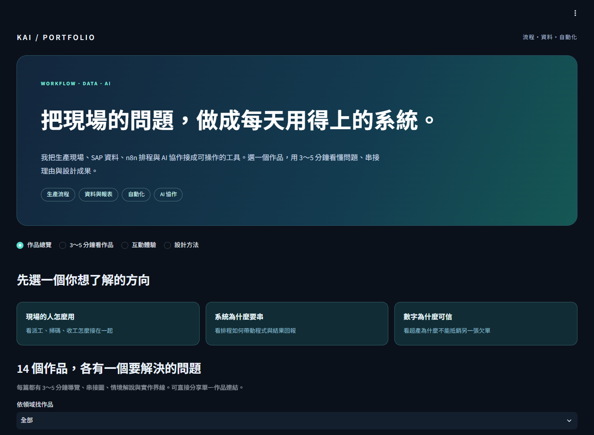

# KAI 個人作品集

[開啟作品集](https://krtqdtupujerpksubdpac2.streamlit.app/)

可獨立部署至 Streamlit Community Cloud 的繁體中文作品集。公開內容只有專案方法與合成示範資料，不讀取私人中控、SAP、公司資料庫或本機工作檔。

## 內容

14 個作品涵蓋 SAP 訂單／製造資料整合、n8n 排程、週報與 Outlook、排程異動、Production BI、完整派工看板、背景 QR 計數、製程日期輔助、RFC 替代驗證、來源與維度、Google 試算表、維運中控、AI 工作架構、每日紀錄與每週回顧。

每個作品都有獨立的 `?case=...` 連結，以及約 3～5 分鐘的閱讀／體驗路徑：問題、原本與後來、串接理由、合成情境、設計取捨、成果與界線。n8n 的系統分工圖不冒充正式 workflow 匯出，已實作與候選狀態分開描述。

- [完整文字作品集](CASEBOOK.md)：可直接閱讀、供 GPT 參考或用於面試準備。
- 互動示範：QR 加減、多碼分組、來源檢核、流程中途失敗、逐訂單認列。
- 下載：單一案例介紹或整本作品集 Markdown；不用登入公司系統。

所有示例都是合成資料，操作只留在訪客自己的工作階段。網站不讀取私人中控、公司 DB 或本機檔案；不執行 SAP、n8n、郵件或 Windows 背景掃碼。不提供未量測的節省工時、效益百分比或公司營運數據。

## 日後調整

一般文案編輯 `portfolio_content.json`：`profile` 是個人介紹、`projects` 是案例、`principles` 是工作方法。每案包括 `status`、`problem`、`before`、`after`、`role`、`flow`、`connections`、`scenarios`、`decisions`、`outcomes`、`evidence`、`limitation`。

編輯後執行 `python export_casebook.py`，同步產生 `CASEBOOK.md`。程式與文案一起 commit / push，網站依發布分支更新。不得放入公司網址、帳密、workflow ID、真實訂單、私人記憶或實際報表。

## 執行

Python 3.11 以上：

```sh
python -m pip install -r requirements.txt
python -m streamlit run app.py
```

## 部署

1. 將本目錄作為獨立 GitHub 儲存庫。
2. Streamlit Community Cloud 選擇該儲存庫、發布分支與 `app.py`。
3. Python 選擇 3.13；本 app 不需要 secrets 或外部資料庫。
4. 完成後檢查 Share 設定，作品集設為公開；私人中控另用私人應用程式。

修改文案後 commit / push，Cloud 依發布分支更新。可透過 GitHub 網頁編輯 JSON，不需要下載整個專案。

## 驗證

```sh
python -m unittest discover -s tests -v
```

測試涵蓋數量、同碼多事件、重送去重、多碼分組、上限、撤銷、來源欄位、時區與 Streamlit AppTest 操作。AppTest 不代表瀏覽器版面驗收。上線前仍須實際檢視 1920、1600、1366、1024 與手機寬度，以及放大文字時是否溢出。

數量與進度日期使用 Asia/Taipei（UTC+08:00）。示範只還原說明所需的核心行為，未直接搬入正式 SAP 或 Windows 程式。


## 畫面預覽



此圖是實際程式的本機預覽。[線上作品集](https://krtqdtupujerpksubdpac2.streamlit.app/)已完成部署。
